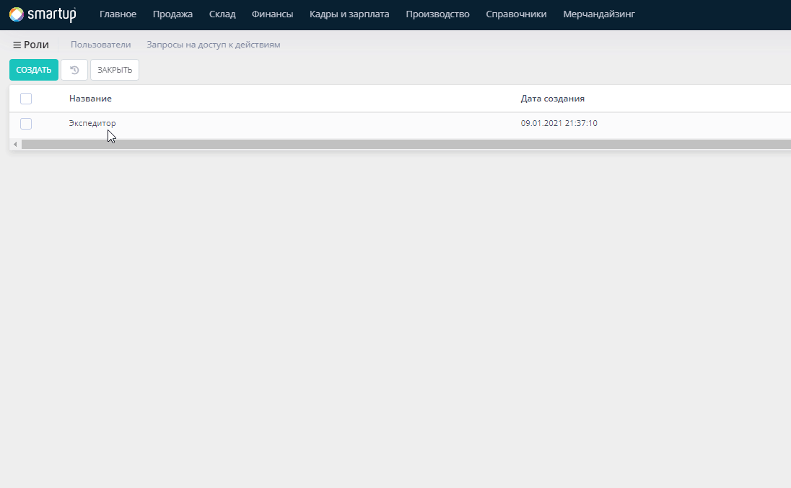
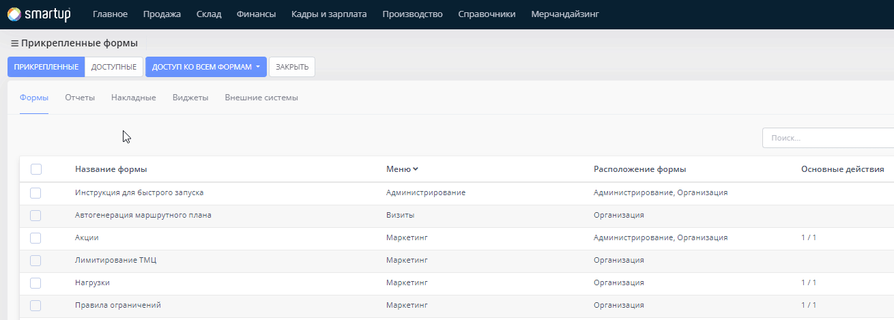
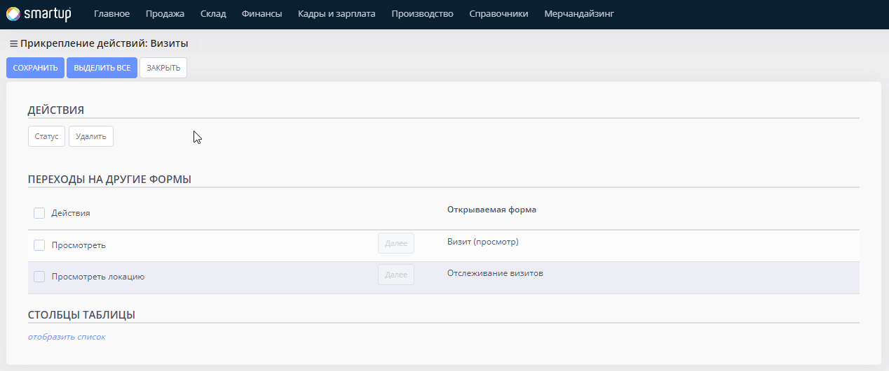

# Шаг 1. Создание орг. структуры

**Организационная структура** - иерархия компании, подразумевающая взаимосвязь сотрудников и распределение ответственности, прав и обязанностей. Структура построения основывается на открытии **Организации** для ведения всей вашей деятельности в системе.

**Организация** — подразделение юридического лица, осуществляющее все его функции или их часть, в том числе функции ~~~~ представительства. Организации (филиалы) наделяют имуществом, создавшее их юридическое лицо, и действует они на основании утверждённых им положений.

**Физические лица** - сотрудники вашей Организации, имеющие доступ к [системе](https://smartup.online/).&#x20;

**Штат или штатная единица**  — это постоянный состав сотрудников организации, предприятия. Штаты дают возможность обозначать объем просматриваемой пользователем информации (только свою, своей группы или всей организации).

**Пользователь** - сотрудник или же лицо, которое имеет учетные данные (логин и пароль) для входа в [систему](https://smartup.online/login.html).

**Роль** - сущность, чаще всего определяется как позиция вашей штатной единицы, за которой могут закрепляться различного рода доступы в системе.

#### С чего начать создание орг. структуры?

1. Вы, являясь администратором системы, должны будете войти под своими учетными данными в [систему](https://smartup.online/login.html), где учетные данные _администратора_ будут выданы, после покупки Лицензий.
2. После входа в систему, вам необходимо будет создать Организацию. Для того чтобы создать Организацию перейдите в меню **Главное -> Организации -> Создать.**&#x20;
3. Как только вы создали Организацию, вам будет необходимо добавить сотрудников, которые работают в вашей Организации, а также распределить соответствующую ответственность каждого и выдать необходимые доступы для того чтобы они также могли начать пользоваться системой


Предисловие:

* Создание и настройка сущностей ведется вашим администратором системы.
* Администратор системы с логином `admin` не может производить никакие транзакции (_проводки_) в системе. Проводки подразумевают формы создания или изменения сущностей с кнопкой **Провести,** где данная кнопка дает возможность проводить транзакцию в системе. Ниже приведен пример формы с  кнопкой **Провести**.

.png>)


## Организация

**Организация** — это самостоятельный хозяйствующий субъект с правами юридического лица, не имеющий в своем составе других юридических лиц, который осуществляет торговую и/или производственную деятельность и связанные с ней услуги.

#### Как создать Организацию?

* Перейдите в меню **Главное -> Организации -> Создать**

<figure><figcaption></figcaption></figure>

<figure><figcaption></figcaption></figure>

* В открывшейся форме, заполните данные:

<mark style="color:red;">Обязательные поля для заполнения:</mark>

* **Организация** - название вашей Организации
* **Базовая валюта** - валюта, с которой работает ваша Организация
* **Юридическое лицо** - лицо, на которое была оформлена ваша Организация. Для [добавления юридического лица](shag-1.-sozdanie-org.-struktury.md#kak-dobavit-yuridicheskoe-lico-v-forme-sozdaniya-organizacii) в текущей форме нажмите на кнопку **Добавить**

<mark style="color:purple;">Опциональные поля для заполнения</mark>:

* **Часовой пояс** - временная зона, по которой работает ваше местное время
* **Порядковый номер** - номер, который указывается для последовательности расположения Организаций в списке всех Организаций

<mark style="color:orange;">Флаги</mark>:

* **Статус** - состояние текущей сущности. Принимает два значения:&#x20;
  * Активный - статус, при котором сущность функционирует
  * Неактивный - статус, при котором сущность не функционирует
* **НДС** - косвенный налог изъятия в бюджет государства части добавленной стоимости товара, работы или услуги. Принимает два значения:
  * Является плательщиком НДС - случай, когда ваша Организация платит налог. При выборе текущего флага вам также будет необходимо указать **Ставку НДС (%)**
  * Не является плательщиком НДС - случай, когда ваша Организация не платит налог
* **Акциз** - косвенный налог, налагаемый в момент производства на товары массового потребления внутри страны. Принимает два значения:&#x20;

Проверьте все введенные данные и нажмите на кнопку **Сохранить**

#### Как добавить Юридическое лицо в форме создания Организации?

После того как вы нажали на кнопку **Добавить** в форме создания Организации, откроется форма создания юридического лица. При создании юридического лица для организации, вам достаточно заполнить следующие данные:

<mark style="color:red;">Обязательные поля для заполнения</mark>:

* **Полное название** - название вашего юридического лица

<mark style="color:purple;">Опциональные поля для заполнения</mark>:

* **ИНН** - Идентификационный номер налогоплательщика, в вашем случае, вашего юридического лица


Впишите свой ИНН и нажмите на кнопку **Поиск**, после чего вся информация о вашем юридическом лице будет перенесена в соответствующие поля текущей формы.


* **Расчетный счет** - ваша учетная запись в банке для учета всех ваших денежных операциях в нашей системе


Все остальные поля в форме **Юридическое лицо (создание)** могут быть заполнены опционально.&#x20;


* После заполнения данных нажмите на кнопку **Сохранить**


После того как вы создали Организацию вам нужно будет в нее войти, для того чтобы начать вести учет данных в вашей собственной Организации. Для того чтобы войти в свою Организацию, после ее создания, обновите страницу (**F5** - горячая клавиша обновления страницы в браузере <mark style="color:blue;">Google Chrome</mark>) и в правом верхнем углу нажмите на кнопку **Администрирование** и выберите из списка ранее созданную Организацию. Ниже в гиф анимации показан пример:




Поздравляем, вы успешно настроили вашу Организацию. Следующим пунктом для завершения текущего шага, вам необходимо настроить Рабочую силу.


## Рабочая сила

**Рабочая сила** или же **рабочий персонал** - сущности, которые являются неотъемлемой частью Орг. структуры вашей Организации. Рабочая сила в нашей системе вбирает в себя такие сущности:

* [Физические лица](shag-1.-sozdanie-org.-struktury.md#fizicheskie-lica)
* [Штат](shag-1.-sozdanie-org.-struktury.md#shtat)
* [Пользователи](shag-1.-sozdanie-org.-struktury.md#polzovateli)
* [Роли](shag-1.-sozdanie-org.-struktury.md#roli)


Настройка каждой из сущностей является уникальной, но в большинстве случаев, в связи с тем что система больше нацелена на сектор _автоматизации оптовой и розничной торговли_, работа с вышеуказанными сущностями будет похожей.


### Физические лица

**Физические лица** - это сотрудники, работающие в вашей Организации. Физическими лицами могут также выступать ваши **Поставщики и Клиенты**. Для того чтобы вести их учет, вам необходимо занести список всех физических лиц в систему.

Занести список физических лиц можно, либо добавляя в систему каждое физическое лицо вручную, либо же импортировать список всех ваших физических лиц в систему.&#x20;


При первом запуске системы, лучше всего выбрать метод импорта всех данных о физических лицах, так как данный процесс займет меньше времени.



Если у вас имеются несколько Организаций, добавление физических лиц лучше осуществлять на уровне **Администрирования,** так как добавив всех сотрудников всех организаций, далее перейдя в нужную из Организаций, вы сможете прикрепить необходимых сотрудников к соответствующей Организации.&#x20;

* Подробности о разделении понятий **Администрирование и Организации**, вы можете получить, перейдя по ссылке.


#### Как внести список всех необходимых физических лиц (сотрудников) в систему при помощи импорта?

* Перейдите в меню **Справочники -> Физические лица -> Импорт**

<figure><figcaption></figcaption></figure>

<figure><figcaption></figcaption></figure>

* В открывшейся форме, нажмите на кнопку **Шаблон**, для того чтобы скачать файл для заполнения данных о ваших сотрудниках

<figure><figcaption></figcaption></figure>

* Откройте скачанный шаблон и заполните необходимые данные

<mark style="color:red;">Обязательные поля для заполнения</mark>:

* Имя - имя вашего сотрудника


Важно!&#x20;

* При внесении данных о ваших сотрудниках в таблицу Excel, оставьте колонку **ИД контрагента** пустой.&#x20;
* Поле **Пол** - принимает только два значения **M** и **F,** где:
  * _M - Male_ (мужской)
  * _F - Female_ (женский)


* Загрузите файл с данными в систему, для этого нажмите на кнопку **Перетащите файл сюда или кликните для выбора файл**
* Нажмите на кнопку **Загрузить и Сохранить,** после чего в списке всех физических лиц у вас появятся все ваши сотрудники, внесенные вами в таблице **Excel**

### Штат

**Штат или штатная единица**  — это постоянный состав сотрудников организации, предприятия. Штаты дают возможность обозначать объем просматриваемой пользователем информации (только свою, своей группы или всей организации).

После добавления ваших сотрудников (физических лиц) в систему, вам нужно будет настроить штатные единицы. Настройка штата подразумевает:

1. [Создание штата](shag-1.-sozdanie-org.-struktury.md#kak-sozdat-shtat)
2. [Выдача доступов к формам](shag-1.-sozdanie-org.-struktury.md#vydacha-dostupov-k-formam)

#### Как создать штат?


Важно! Штат создается только на уровне **Организации**!


Перейдите в меню **Справочники -> Штат -> Создать**

<figure><figcaption></figcaption></figure>

<figure><figcaption></figcaption></figure>

* В открывшейся форме, заполните поля:

<mark style="color:red;">Обязательные поля для заполнения</mark>:

* **Название** - наименование вашего штата.


Зачастую, чтобы легче было работать с наименованиями, лучше всего указывать название вашего штата как название позиции вашей роли. Например, если у вас имеется роль с названием **Экспедитор**, то штат можно будет назвать как **Экспедитор 1-го разряда**. Для более точной информации, можно добавлять в название штата, название вашей рабочей зоны.


<mark style="color:purple;">Опциональные поля для заполнения</mark>:

* **Код** - уникальный код, который используется для поиска текущего штата в списке всех доступных штатов. Также данное поле служит ключом для идентификации штатов при интеграции с внешними системами
* **Роли** - сущность, за которой закрепляются определенного рода доступы. В данной форме,  вы можете указать уже имеющуюся системную роль (_например, торговый представитель, мерчандайзер и т.д._)


Для удобства, вы сразу можете закреплять определенную роль за штатом, что даст возможность данному штату доступ к определенным формам.


* **Пользователь** - сотрудник, который имеет учетные данные для входа в систему. В данной форме, так как вы еще не создавали пользователя, данный пункт пропускается.
* **Рабочие зоны** - рабочая территория сотрудников, которая служит для разделения всех рабочих процессов по реализации товаров. В данной форме, вы можете закрепить текущий штат за несколькими рабочими зонами.
* **Руководитель** - ответственное лицо за текущим штатом.

<mark style="color:orange;">Флаги</mark>:

* **Статус** - состояние текущей сущности. Принимает два значения:&#x20;
  * Активный - статус, при котором сущность функционирует
  * Неактивный - статус, при котором сущность не функционирует

* После заполнения необходимых данных, нажмите на кнопку **Сохранить**


Пример, при создании штата с ролью **Экспедитор**, обычно прикрепляют к нескольким рабочим зонам, так как экспедиторы могут выезжать в различные торговые точки, расположенные в различных рабочих зонах.


#### Выдача доступов к формам

Штатам выдается доступ к формам для того, чтобы открыть доступ к определенному количеству форм.

* В форме Штаты, кликните на ранее созданный вами штат и нажмите на кнопку **Доступ к формам**

<figure><figcaption></figcaption></figure>

* В открывшейся форме, вам будут доступны наименования форм в колонке **Название**, для которых вы можете выдать доступ вашим штатам на работу с текущими формами.&#x20;
  * Колонка **Показать все -** в данной колонке, напротив каждой из форм, при выборе, открывается полный доступ на возможность просматривать все документы выбранной формы для текущего штата.
  * Колонка **Показать данные по рабочим зонам** - в данной колонке, напротив каждой из форм, при выборе, открывается доступ на возможность просматривать формы, которые были закреплены за рабочими зонами, за которой также был закреплен текущий штат.
  * Колонка **Показать мои данные** - в данной колонке, напротив каждой из форм, при выборе, открывается доступ на возможность просматривать документы текущей формы, доступные только для текущего штата.
* По завершению выдачи доступов, нажмите на кнопку **Сохранить**


Штату с ролью **Оператор**, желательно открыть доступ на просмотр всех форм, так как оператор в вашей системе должен постоянно работать с различными рода документами.



Пункт **Показать данные по рабочим зонам** выбирается в том случае,  когда вы хотите выдать доступ оператору, которому должна быть доступна информацию только одной рабочей зоны.


### Пользователи

**Пользователь** - сотрудник, который входит в вашу систему под учетными данными.&#x20;

Как только были созданы соответствующие пользователи (_логин и пароль_), сотрудники смогут войти под своими учетными данными.

#### Как создать пользователя?

* Перейдите в меню **Главное -> Пользователи -> Создать**

<figure><figcaption></figcaption></figure>

<figure><figcaption></figcaption></figure>

* В открывшейся форме, вам достаточно будет заполнить следующие поля

<mark style="color:red;">Обязательные поля для заполнения</mark>:

* **Ф.И.О.** - фамилия, имя и отчество пользователя
* **Физическое лицо** - сотрудник, который был добавлен в систему путем импорта, в самом начале текущей статьи. То есть, физическое лицо, будет закреплено за текущим пользователем системы.
* **Логин** - логин для авторизации в системе
* **Пароль** - пароль для авторизации в системе
* **Штат** - позиция, на которую будет определен текущий пользователь.

<mark style="color:purple;">Опциональные поля для заполнения</mark>:

* **Код -** уникальный код, который используется для поиска текущего пользователя в списке всех доступных пользователей. Также данное поле служит ключом для идентификации пользователей при интеграции с внешними системами
* **Руководитель** - ответственное лицо, которое будет отвечать за текущего пользователя
* **Часовой** пояс - временная зона, в которой будет работать текущий пользователь
* **Email -** почтовый ящик

<mark style="color:orange;">Флаги</mark>:

* **Пол** - половой признак пользователя. Принимает два значения:
  * Мужской
  * Женский
* **Статус** - состояние текущей сущности. Принимает два значения:&#x20;
  * Активный - статус, при котором сущность функционирует
  * Неактивный - статус, при котором сущность не функционирует

а также поля:

* **Логин пользователя e-factura -** логин для доступа в систему **** [**Faktura.uz**](https://faktura.uz/)
* **Пароль пользователя e-factura -** пароль для доступа в систему **** [**Faktura.uz**](https://faktura.uz/)


[Faktura.uz](https://faktura.uz/) - сервис, при помощи которого вы можете вести свой документооборот в системе. Имея доступ к данному сервису, вы сможете отправлять счет-фактуры своим клиентам через систему [Smartup X](https://smartup.online/).


* После заполнения необходимых данных нажмите на кнопку **Сохранить**

### Роли

**Роль** - сущность, за которой могут закрепляться различного рода доступы в системе. По умолчанию, в системе уже имеются роли. Наличие прикрепленных ролей к штату или пользователю недостаточно, так как вам также нужно будет настроить необходимые доступы для каждой из роли, для того чтобы разграничить доступы.

#### Выдача доступов для ролей

Выдача доступов для ролей нужна для того, чтобы пользователи, за которыми закреплены роли, могли выполнять определенные действия в системе. Доступы выдаются для возможности выполнять операции или же возможности просматривать определенные формы с дальнейшей настройкой действий кнопок.



Для того чтобы выдать доступ для определенной роли на возможность выполнять определенные операции (_оформлять заказ, отслеживать пользователей и т.д._):

* Перейдите в меню **Главное -> Пользователи -> Роли**

<figure><figcaption></figcaption></figure>

<figure><figcaption></figcaption></figure>

* В открывшейся форме кликните на роль, для которой хотите настроить доступ, и нажмите на кнопку **Изменить**

<figure><figcaption></figcaption></figure>

* Затем, переводите положение тумблера в положение **да** для тех форм, для которых хотите открыть доступ на выполнение соответствующих операций.&#x20;


Например, если вы хотите выдать доступ роли **Экспедитор** возможность выполнять доставку, то вам нужно переключить положение тумблера в положение да напротив поля **Доставка.** Ниже, в гиф анимации показан пример выполнения


<figure><figcaption></figcaption></figure>

* После выдачи необходимых доступов нажмите на кнопку **Сохранить**



Для того чтобы выдать доступ для определенной роли на возможность просматривать нужные формы, а также выдавать доступ на выполнение определенных действий (_нажатие кнопок_)

* Перейдите в меню **Главное -> Пользователи -> Роли**

<figure><figcaption></figcaption></figure>

<figure><figcaption></figcaption></figure>

* В открывшейся форме кликните на роль, для которой хотите настроить доступ, и нажмите на кнопку **Прикрепление -> Прикрепление доступов**

<figure><figcaption></figcaption></figure>


Вам будут доступны пункты **Прикрепленные и Доступные**, в которых буду располагаться список прикрепленных и доступных форм для прикрепления к текущей роли соответственно


* Перейдите в пункт **Доступные**. кликните на форму, которую хотите прикрепить и нажмите на кнопку **Прикрепить**

<figure><figcaption></figcaption></figure>

* После прикрепления данной формы, вам необходимо будет выдать доступ к действиям кнопок, для этого, уже в пункте **Прикрепленные**, кликните на форму и нажмите на кнопку **Далее**

<figure><figcaption></figcaption></figure>

* В открывшейся форме вам нужно будет выдать доступ на возможность выполнять определенные действия с текущей формой. Кликните на кнопку, для того чтобы активировать доступ к действию или же установить флаг напротив формы

<figure><figcaption></figcaption></figure>


Если кнопка подсвечивается <mark style="background-color:green;">Зеленым цветом</mark>, то у данной формы имеется доступ к текущему действию.



Если у формы имеются вложенные формы, в блоке **Переходы на другие формы**, вы можете прикреплять доступы  к действиям кнопок, нажав на кнопку **Далее**


* Как только вы настроили необходимые доступы к действиям кнопок, нажмите на кнопку **Сохранить**




Поздравляем! Вы завершили первый шаг быстрого старта. [Перейти в следующему шагу](shag-2.-napolnenie-spravochnikov.md).


