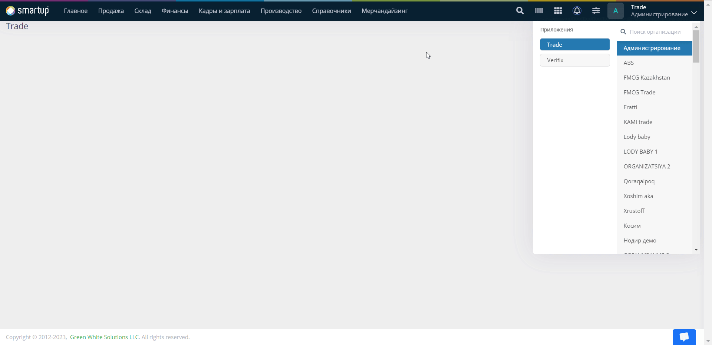
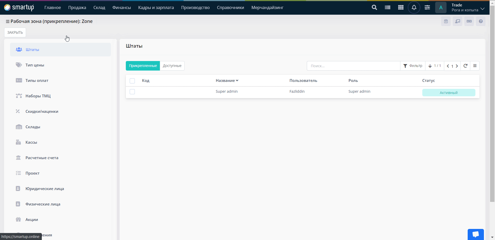

# Шаг 2. Наполнение справочников

**Наполнение справочников -** процесс, в течение которого вам необходимо будет заполнить информацию о различных сущностях (объектах), которые выступают в роли прикладных конфигураторов в вашей системе.&#x20;

Для наполнения справочников вам нужно:

1. [Занести товар, который в дальнейшем будет продаваться](shag-2.-napolnenie-spravochnikov.md#tmc)
2. [Указать все типы цен и оплат, использующиеся в вашей Организации](shag-2.-napolnenie-spravochnikov.md#tipy-cen-i-oplat)
3. [Заполнить вашу клиентскую базу](shag-2.-napolnenie-spravochnikov.md#baza-kontragentov)
4. [Настроить рабочую зону](shag-2.-napolnenie-spravochnikov.md#rabochaya-zona)

## ТМЦ

**ТМЦ** - товарно-материальные ценности вашей Организации. Товарно-материальными ценностями могут выступать следующие сущности: товар, сырье, продукция или же  рекламное оборудование.


Подробности о понятиях товарно-материальных ценностях вы можете найти в нашем глоссарии.


Наполнение справочников ТМЦ является первым пунктом, так как вы или же ваша Организация точно должна знать продажей какого вида товаров она занимается. Также, добавление товаров в систему является первой, потому что все дальнейшие действия с товаром (установка цен на товар, продажа, закуп) напрямую зависит от ее присутствия в системе.


При первом запуске системы, лучше всего выбрать метод импорта всех данных о ТМЦ, так как данный процесс займет меньше времени.


#### Как внести список всех необходимых ТМЦ(товаров) в систему при помощи импорта?


Импортирование ТМЦ доступно лишь на уровне Администрирования!


* Перейдите в меню **Справочники -> ТМЦ -> Импорт**

<figure><figcaption></figcaption></figure>

<figure><figcaption></figcaption></figure>

* В открывшейся форме, нажмите на кнопку **Шаблон**, для того чтобы скачать файл для заполнения данных о ТМЦ

<figure><figcaption></figcaption></figure>

* Откройте скачанный шаблон и заполните данные

<mark style="color:red;">Обязательные поля для заполнения</mark>:

* **Название** - наименование вашей ТМЦ
* **Ед. изм.** - единица измерения текущей ТМЦ. Если ваша продукция продается штучно, то в текущей колонке вам нужно указать `шт`
* **Товар, Продукция, Сырье, Рекламное оборудование -** в одной из текущих колонок укажите значение `Y` для соответствующего типа ТМЦ

<figure><figcaption></figcaption></figure>


Если у вашей продукции имеются определенные характеристики (_группы, категории_) вы можете заполнить соответствующие колонки. Например, у вас есть продукция с названием **Кофе**, ваше кофе также является зерновым, то в колонку **Группа**, вы можете вписать **Зерновые**, тем самым определите, что данный тип кофе относится к зерновым.



Остальные поля заполняются выборочно, исходя из ваших потребностей.


* Загрузите файл с данными в систему, для этого нажмите на кнопку **Перетащите файл сюда или кликните для выбора файл**
* Нажмите на кнопку **Загрузить и Сохранить,** после чего в списке всех ТМЦ у вас появятся все ваши товары, внесенные вами в таблице **Excel**

Как только вы внесли все необходимые товары, вам необходимо будет разбить ваши товары по портфелям, за которым будут закреплены соответствующие ТМЦ. Разбиение товаров по портфелям необходимо для того, чтобы:

1. Разграничить доступность товаров между вашими пользователями(_торговыми представителями_)
2. Разграничить использование товаров между несколькими Организациями.


В системе, портфели обозначаются как **Наборы ТМЦ.**


#### Как разбить товары по наборам ТМЦ?

Для того чтобы разбить товары по наборам, вам необходимо будет:

* [Создать наборы](shag-2.-napolnenie-spravochnikov.md#sozdanie-naborov)
* [Прикрепить ТМЦ к соответствующим наборам](shag-2.-napolnenie-spravochnikov.md#prikreplenie-tmc-k-naboru)
* [Прикрепить нужные наборы к Организации](shag-2.-napolnenie-spravochnikov.md#prikreplenie-naborov-k-organizacii)

#### Создание наборов

* Перейдите в меню **Справочники -> ТМЦ -> Наборы ТМЦ -> Создать**

<figure><figcaption></figcaption></figure>

* В открывшейся форме, заполните поля:

<mark style="color:red;">Обязательные поля для заполнения</mark>:

* **Название** - наименование вашего набора

<mark style="color:purple;">Опциональные поля для заполнения</mark>:

* **Код -** уникальный код, который используется для поиска текущего набора в списке всех доступных наборов. Также данное поле служит ключом для идентификации наборов при интеграции с внешними системами

<mark style="color:orange;">Флаги</mark>:

* **Статус** - состояние текущей сущности. Принимает два значения:&#x20;
  * Активный - статус, при котором сущность функционирует
  * Неактивный - статус, при котором сущность не функционирует

#### Прикрепление ТМЦ к набору

* В форме **Наборы ТМЦ** кликните на ранее созданные набор и нажмите на кнопку **Прикрепить**

<figure><figcaption></figcaption></figure>

* В открывшейся форме, перейдите в пункт **Доступные**, выберите необходимые ТМЦ и нажмите на кнопку **Прикрепить**

<figure><figcaption></figcaption></figure>

#### Прикрепление наборов к Организации

* Перейдите в свою Организацию, далее, перейдите в меню **Справочники -> ТМЦ -> Наборы ТМЦ -> Прикрепление**

<figure><figcaption></figcaption></figure>

* Затем, выберите нужные наборы ТМЦ, которые будут использоваться в текущей Организации. Для этого, кликните на набор и нажмите на кнопку **Прикрепить**

<figure><figcaption></figcaption></figure>


Как только были прикреплены соответствующие наборы, в списке всех ТМЦ должны появиться ваши товары. На этом первый пункт по наполнению справочников завершен.


## Типы цен и оплат

В этом шаге, после того как вы добавили все ТМЦ, вам нужно будет настроить типы цен и оплат для внесенных вами товаров. Для этого, вам нужно:

1. [Настроить цены](shag-2.-napolnenie-spravochnikov.md#nastroika-cen)
2. [Прикрепить необходимые типы оплат](shag-2.-napolnenie-spravochnikov.md#2.-prikreplenie-tipov-oplat)

### 1. Настройка цен

Настройка цен подразумевает:

* [Создание цены](shag-2.-napolnenie-spravochnikov.md#sozdanie-ceny)
* [Установка цены на товар](shag-2.-napolnenie-spravochnikov.md#ustanovka-ceny-na-tovar)

#### Создание цены

* Перейдите в меню **Справочники -> Цены -> Создать**

<figure><figcaption></figcaption></figure>

* В открывшейся форме, заполните данные:

<mark style="color:red;">Обязательные поля для заполнения</mark>:

* **Название** - наименование вашей цены
* **Валюта** - валюта, в которой будет продаваться ваш товар


Остальные поля заполняются опционально, исходя из ваших потребностей. Подробности о создании цен, вы можете найти, перейдя по ссылке.


* Проверьте все данные и нажмите на кнопку **Сохранить**

#### Установка цены на товар

* В форме **Цены**, кликните на нужную цену и нажмите на кнопку **Установка цен**

<figure><figcaption></figcaption></figure>

* В открывшейся форме, напротив каждого товара проставьте **Цены**

<figure><figcaption></figcaption></figure>

* Проверьте все данные и нажмите на кнопку **Сохранить**

### 2. Прикрепление типов оплат

Типы оплат прикрепляются для того, чтобы в дальнейшей продаже товара иметь возможность получать сумму за проданный товар.&#x20;


В системе имеются 4 типа оплат: **наличные деньги, перечисление, терминал и чековая книжка**


* Перейдите в меню **Справочники -> Цены -> Типы оплат -> Прикрепление**

<figure><figcaption></figcaption></figure>

* Выберите нужные тип оплат и нажмите на кнопку **Прикрепить**

<figure><figcaption></figcaption></figure>


При прикреплении определенного типа оплат к цене, то, например, при выборе данной цены при оформлении заказа, в пункте Оплата будет отображаться только типы оплат, закрепленные за текущей ценой.


#### Как прикрепить определенный тип оплат к цене?

* Перейдите в меню **Справочники -> Цены**&#x20;

<figure><figcaption></figcaption></figure>

* В открывшейся форме кликните на цену, к которой хотите прикрепить нужное количество типов оплат и нажмите на кнопку **Прикрепление -> Прикрепление типов оплат**

<figure><figcaption></figcaption></figure>

* Далее, перейдите в пункт **Доступные**, выберите тип оплат и нажмите на кнопку **Прикрепить**


В системе, по умолчанию, имеется 4 типа цен (_акция, промо, возврат и передача за баланс_), которые могут быть закреплены за Организацией, для того чтобы в Организации была возможность выполнять соответствующие действия.


## База контрагентов

**База контрагентов** - лица, выступающие в роли ваших клиентов и/или поставщиков. Для того чтобы начать производить закуп товаров от поставщиков и продажу товара клиентам, вам необходимо будет внести их в систему.


При первом запуске системы, лучше всего выбрать метод импорта всех данных о клиентах и поставщиках, так как данный процесс займет меньше времени.


#### Как внести список всех клиентов/поставщиков в систему при помощи импорта?

* Перейдите в меню **Справочники -> Юридические лица -> Импорт**

<figure><figcaption></figcaption></figure>

<figure><figcaption></figcaption></figure>

* Переключите положение тумблера **Поставщик** или **Клиент**, для того чтобы ввести информацию о ваших поставщиках или клиентах соответственно

<figure><figcaption></figcaption></figure>

* В открывшейся форме, нажмите на кнопку **Шаблон**, для того чтобы скачать файл для заполнения данных о ваших клиентах/поставщиках

<figure><figcaption></figcaption></figure>

* Откройте скачанный шаблон и заполните необходимые данные

<mark style="color:red;">Обязательные поля для заполнения</mark>:

* **Название** - наименование вашего поставщика


Все остальные поля могут быть заполнены опционально.&#x20;


* Загрузите файл с данными в систему, для этого нажмите на кнопку **Перетащите файл сюда или кликните для выбора файл**
* Нажмите на кнопку **Загрузить и Сохранить,** после чего в списке всех физических лиц у вас появятся все ваши сотрудники, внесенные вами в таблице **Excel**

## Рабочая зона

**Рабочая зона** - это настраиваемая территория, на которой осуществляются все рабочие процессы. Создавая для каждой территориальной единицы (район/территория/участок) отдельную рабочую зону, Вы получаете инструмент, позволяющий безболезненно выполнять действия по смене и рокировке полевого персонала (торговый представитель/доставщик/мерчандайзер).

Для того чтобы вести учет всех ваших операций в системе, за каждой рабочей зоной, вам необходимо будет закреплять соответствующие сущности, такие как, _**цены, штат, юр. и физ. лица, акции**_ ... Закрепленные сущности, будут работать только за закрепляемой рабочей зоной.


Например, у вас имеется дистрибьюторская Организация, которая занимается поставкой товаров в торговые точки. Ваши торговые точки расположены в различных районах вашего города. Ваша цель, распределить вашу рабочую силу так, чтобы одни торговые представители могли оформлять заказы в одном Районе, а другие в другом. В этом случае, вам поможет то самое разделение на рабочие зоны, где за каждой рабочей зоной вы можете закрепить необходимый штат (ваши пользователи), который будет иметь только доступ к закрепленной рабочей зоне.


### Как настроить рабочую зону?

Настройка рабочей зоны подразумевает ее:

* [Создание](shag-2.-napolnenie-spravochnikov.md#sozdanie)
* [Прикрепление сущностей](shag-2.-napolnenie-spravochnikov.md#prikreplenie-sushnostei)

#### Создание&#x20;

* Перейдите в меню **Справочники -> Рабочие зоны -> Создать**

<figure><figcaption></figcaption></figure>

<figure><figcaption></figcaption></figure>

* В открывшейся форме, заполните поля:

<mark style="color:red;">Обязательные поля для заполнения</mark>:

* **Название** - наименование вашей рабочей зоны.


Название вашей рабочей зоны должно быть максимально точным, для того чтобы вы могли правильно разграничить ваши рабочие территории.

Пример. Ваша дистрибьюторская **Организация** находится в Ташкенте, и у вашей организации есть торговые точки, расположенные в разных районах города (_**Мирзо-Улугбекский район, Шайхантахурский район и т.д.**_), а также у вас имеются торговые представители, которые посещают текущие торговые точки. В текущей ситуации, правильней будет назвать вашу рабочую зону именами ваших районов.


<mark style="color:purple;">Опциональные поля для заполнения</mark>:

* **Код** - уникальный код, который используется для поиска текущего штата в списке всех доступных штатов. Также данное поле служит ключом для идентификации штатов при интеграции с внешними системами
* **Тип рабочей зоны** - поле, где указывается или же добавляется тип рабочей зоны. Данное понятие подразумевает разделение рабочей зоны на определенные группы.
* **Порядковый номер** - номер, который указывается для последовательности расположения рабочих зон в списке всех Рабочих зон

<mark style="color:orange;">Флаги</mark>:

* **Статус** - состояние текущей сущности. Принимает два значения:&#x20;
  * Активный - статус, при котором сущность функционирует
  * Неактивный - статус, при котором сущность не функционирует

* Проверьте все данные и нажмите на кнопку **Сохранить**

#### **Прикрепление сущностей**

В текущем блоке вам необходимо будет разграничить доступы для ранее созданных сущностей (_наборы ТМЦ, типы цен и оплат, поставщиков и клиентов_) и сущностей, которые уже есть в системе (_склад и касса_).

* Перейдите в меню **Справочники -> Рабочие зоны**
* В открывшейся форме, кликните на ранее [созданную рабочую зону](shag-2.-napolnenie-spravochnikov.md#sozdanie) и нажмите на кнопку **Прикрепление**

<figure><figcaption></figcaption></figure>


Прикрепление сущностей будет на примере прикрепления Наборов ТМЦ! Все остальные сущности будут прикрепляться аналогичным образом.


* В открывшейся форме, перейдите в пункт **Наборы ТМЦ -> Доступные**, выберите нужные наборы, которые будут закреплены за текущей рабочей зоной, и нажмите на кнопку **Прикрепить**.

<figure><figcaption></figcaption></figure>


В системе, по умолчанию, имеются склад и касса, если в вашей Организации имеются несколько складов и касс, вам нужно будет добавить их, а потом уже прикрепить к нужной рабочей зоне. Для того чтобы добавить новую кассу/склад в форме прикрепления рабочей зоны, перейдите в пункт **Склады/Кассы -> Доступные -> Создать кассу/Создать склад**. Затем заполните соответствующие данные.



Поздравляем, вы завершили второй шаг быстрого старта. [Перейти к следующему шагу](shag-3.-vvod-nachalnykh-ostatkov.md).

