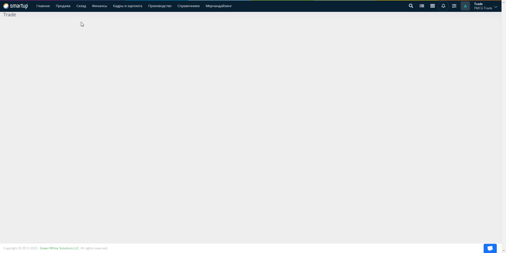
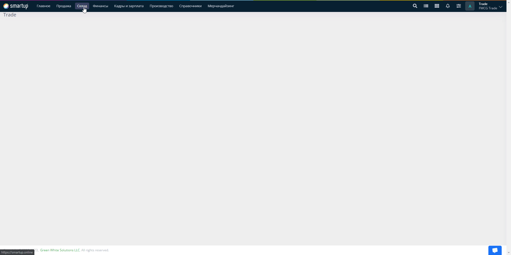

# Шаг 3. Ввод начальных остатков

**Ввод начальных остатков** - процесс переноса данных (ТМЦ, баланс клиентов, баланс поставщиков, счетов и оборудования) на момент начала ведения вашей Организации. Иными словами, это ввод всех данных о вышеуказанных сущностях до начала работы в нашей системе (Smartup).


Текущий шаг пропускается в случае если у вас новая Организация и весь учет ваших данных вы начинаете после запуска нашей системы.


Ввод начальных остатков подразумевает:

* [Ввод начальных остатков ТМЦ](shag-3.-vvod-nachalnykh-ostatkov.md#vvod-nachalnykh-ostatkov-tmc)
* [Ввод начального баланса счетов](shag-3.-vvod-nachalnykh-ostatkov.md#vvod-nachalnogo-balansa-schetov)
* [Ввод начального баланса клиентов](shag-3.-vvod-nachalnykh-ostatkov.md#vvod-nachalnogo-balansa-klientov)
* [Ввод начального баланса поставщиков](shag-3.-vvod-nachalnykh-ostatkov.md#vvod-nachalnogo-balansa-postavshikov)
* [Ввод начальных остатков оборудования клиентов](shag-3.-vvod-nachalnykh-ostatkov.md#vvod-nachalnykh-ostatkov-oborudovaniya-klientov)


Предисловие: В связи с тем, что администратор системы не может выполнять никакие проводки в системе, вам необходимо будет войти под другими учетными данными пользователей, которые будут выполнять соответствующие проводки в системе. В текущем случае, войдите под учетными данными пользователя, который будет выполнять ввод начальных остатков (зачастую это пользователь с ролью **Оператор**, который будет выполнять определенные проводки в системе).


## Ввод начальных остатков ТМЦ

* Перейдите в меню **Склад -> Ввод начальных остатков ТМЦ -> Создать**

<figure><figcaption></figcaption></figure>

<figure><figcaption></figcaption></figure>

* В открывшейся форме заполните поля:

<mark style="color:red;">Обязательные поля для заполнения</mark>:

* **Дата** - дата ввода текущих остатков ТМЦ
* **Валюта** - валюта, которая будет  использована для текущих остатков ТМЦ для дальнейшей реализации товара
* **Склад** - склад определения текущих ТМЦ
* **Название** - список, где выбирается ТМЦ, которое было введено вами при [наполнении справочников](shag-2.-napolnenie-spravochnikov.md). При выборе нужной ТМЦ, вам также необходимо указать:
  * Кол-во - количество товара
  * Цена - цена товара


Для того чтобы ускорить процесс ввода остатков, вы можете воспользоваться подбором или же импортом. Ниже показано расположение соответствующих кнопок.


<figure><figcaption></figcaption></figure>


Остальные поля заполняются опционально. Подробности о вводе начальных остатков ТМЦ вы можете найти по ссылке.


* Проверьте все данные и нажмите на кнопку **Провести**


После того как вы провели документ, у вас должны появиться остатки. Перейдите в меню **Склад -> Остатки ТМЦ** для того чтобы просмотреть ваши остатки.


## Ввод начального баланса счетов

* Перейдите в меню **Склад -> Ввод начальных остатков ТМЦ -> Ввод начального баланса счетов -> Создать**

<figure><figcaption></figcaption></figure>

* В открывшейся форме заполните поля:

<mark style="color:red;">Обязательные поля для заполнения</mark>:

* **Дата** - дата ввода текущего баланса счетов
* **Валюта** - валюта, которая будет использоваться для текущего баланса
* **Выбрать счет** - поле, где выбирается счет, по которому вам необходимо будет указать сумма в поле **Сумма**


Остальные поля заполняются опционально. Подробности о вводе начального  баланса счетов вы можете найти по ссылке.


* Проверьте все данные и нажмите на кнопку **Провести**

## Ввод начального баланса клиентов

* &#x20;Перейдите в меню **Склад -> Ввод начальных остатков ТМЦ -> Ввод начального баланса клиентов -> Создать**

<figure><figcaption></figcaption></figure>

* В открывшейся форме заполните поля:

<mark style="color:red;">Обязательные поля для заполнения</mark>:

* **Дата** - дата текущего баланса клиента
* **Валюта** - валюта, по которой будет работать ваш клиент и ваша Организация
* **Название** - лицо, которому поставляется ваш товар (продажа), при выборе которого вам будет необходимо указать следующие поля:
  * **Задолженность клиента (дебет)** - сумма задолженности клиента за товар
  * **Предоплата клиента (кредит)** - сумма предоплаты клиента за товар


Остальные поля заполняются опционально. Подробности о вводе начального  баланса клиентов вы можете найти по ссылке.


* Проверьте все данные и нажмите на кнопку **Провести**

## Ввод начального баланса поставщиков

* Перейдите в меню **Склад -> Ввод начальных остатков ТМЦ -> Ввод начального баланса поставщиков -> Создать**

<figure><figcaption></figcaption></figure>

* В открывшейся форме заполните поля:

<mark style="color:red;">**Обязательные поля для заполнения**</mark>:

* **Дата** - дата текущего баланса поставщика
* **Валюта** - валюта, по которой будет работать ваш поставщик и ваша Организация
* **Поставщик -** лицо, поставляющее товар в вашу Организацию, при выборе которого вам будет необходимо указать следующие поля:
  * Предоплата поставщикам (дебет) - сумма предоплаты вашей Организации поставщикам
  * Задолженность поставщикам (кредит) - сумма задолженности вашей Организации поставщикам


Остальные поля заполняются опционально. Подробности о вводе начального баланса поставщиков вы можете найти по ссылке.


* Проверьте все данные и нажмите на кнопку **Провести**

## Ввод начальных остатков оборудования клиентов

* Перейдите в меню **Склад -> Ввод начальных остатков ТМЦ -> Ввод начальных остатков оборудования клиентов -> Создать**

<figure><figcaption></figcaption></figure>

* В открывшейся форме заполните поля:

<mark style="color:red;">Обязательные поля для заполнения</mark>:

* **Дата** -  дата текущих остатков оборудования&#x20;
* **Клиент** -  список, где выбирается клиент, у которого имеется оборудование, при выборе клиента вам также необходимо указать следующие поля:
  * **Оборудование** - оборудование клиента, выданное вашей Организацией
  * **Серийный номер** -  серийный номер оборудования
  * **Цена** - цена за использование текущего оборудования


Остальные поля заполняются опционально. Подробности о вводе начальных остатков оборудования клиента вы можете найти по ссылке.


* Проверьте все данные и нажмите на кнопку **Провести**


Поздравляем, вы завершили третий шаг быстрого старта. [Перейти к следующему шагу](shag-4.-zakup-i-prodazha-tovara/).

