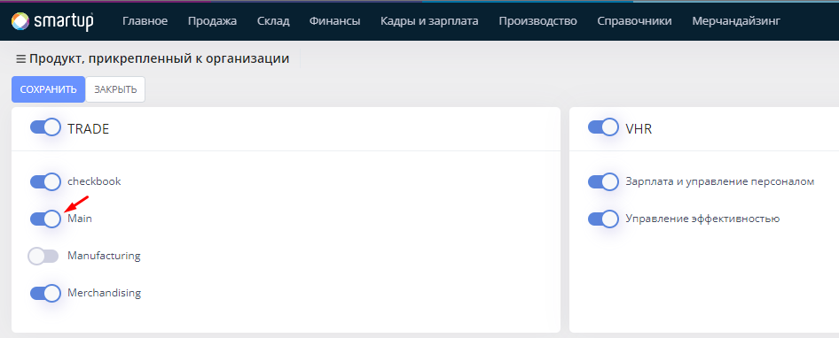

# Закуп товара

**Закуп товара** - процесс купли товаров для их дальнейшей реализации в вашей Организации. В данном процессе участвую две стороны, поставщики и вы.

## Процесс закупа товара

* Перейдите в меню **Склад -> Закупки -> Создать**

<figure><figcaption></figcaption></figure>

<figure><figcaption></figcaption></figure>

* В открывшейся форме заполните следующие блоки:

1. [Основное](zakup-tovara.md#osnovnoe)
2. [ТМЦ](zakup-tovara.md#tmc)
3. [Завершение](zakup-tovara.md#zavershenie)

### Основное

<mark style="color:red;">Обязательные поля для заполнения</mark>:

* **Дата закупки** - дата закупа ваших товаров
* **Шаблон операции** - список, где выбирается шаблон, по которому будут определяться нижестоящие поля (_поставщик, договор, тип оплаты_...). В системе имеется системный шаблон на закуп, основанный на вида движений (_приходы и расходы_). Для того чтобы добавить новый шаблон операции, нажмите на кнопку **Добавить**.
* **Поставщик** - лицо, поставляющее товар в вашу Организацию. Добавление поставщика описано [во втором шаге быстрого старта](../shag-2.-napolnenie-spravochnikov.md#baza-kontragentov).
* **Рабочая зона** - рабочая территория, на которой осуществляется процесс закупа товаров. [Из ранее созданных рабочих зон](../shag-2.-napolnenie-spravochnikov.md#rabochaya-zona), выбирается та, которая непосредственно связана с текущим закупом товара.&#x20;


При оформлении закупа, в поле При оформлении закупа, в поле **Штат** желательно выбирать штат с ролью **Оператор**, так как большинство проводок документов выполняет именно оператор вашей системы.


* **Штат** - лицо, ответственное за оформление текущего закупа.
* **Валюта** - валюта оприходования товара по текущему закупу

<mark style="color:orange;">Флаги</mark>:

* **С поступление на склад** - опция, которая определяет возможность мгновенного оприходования текущего закупа товара на склад. При выборе данной опции вам также нужно будет указать **Склад**, куда будут оприходоваться товары.
* **Внести дополнительные расходы** - опция, которая предоставляет возможность внести иные расходы по текущему закупу. При включении данной опции, появляется новый блок **Дополнительные расходы**.


В случае если вы хотите оформлять два разных документа о закупе и поступлении, флаг <mark style="color:blue;">С поступлением на склад</mark> не выбирается. После завершения закупки вам нужно, в форме **Склад -> Поступления ТМЦ на склад**, создать документ **Поступления ТМЦ** по вышеуказанному закупу.



Остальные поля заполняются опционально. Подробности о закупе товара, вы можете найти по ссылке.


### ТМЦ

<mark style="color:red;">Обязательные поля для заполнения</mark>:

*   **Товар, Сырье, Рекламное оборудование, Услуга** - типы ТМЦ, выбрав один из которых вам нужно указать:

    * Название -список, где выбирается ТМЦ, которое было введено вами при [наполнении справочников](../shag-2.-napolnenie-spravochnikov.md). При выборе нужной ТМЦ, вам также необходимо указать:
      * Кол-во - количество товара
      * Цена - цена товара


Для того чтобы ускорить процесс ввода остатков, вы можете воспользоваться подбором или же импортом. Ниже показано расположение соответствующих кнопок.


<figure><figcaption></figcaption></figure>

### Завершение

<mark style="color:orange;">Флаги</mark>:

* **Статус** - состояние закупа текущих товаров, где статус принимает следующие значения:
  * Черновик - состояние закупа товара, при применении которого закуп товара становится недействительным
  * Новый - состояние закупа товара, при применении которого закуп товара становится действительным. Данное состояние подразумевает что закуп товар не был осуществлен, так как еще не был доставлен в вашу Организацию.
  * В пути - состояние закупа товара, при применении которого закуп товара становится действительным. Данное состояние подразумевает что закупаемый товар еще в пути.
  * Завершено - состояние закупа товара, при применении которого закуп товара становится действительным. Данное состояние подразумевает что закуп товара в вашу Организация был завершен, то есть проводка документа о закупе была осуществлена.
  * В таможне - состояние закупа товара, при применении которого закуп товара становится действительным. Данное состояние подразумевает что закупаемый товар находится на таможне.


Вышеуказанные статусы указываются для того, чтобы определять состояние выполнения вашей проводки документа о закупе товара.


Проверьте все данные и нажмите на кнопку **Провести.** Для того чтобы временно сохранить документ, нажмите на кнопку **Сохранить**..

