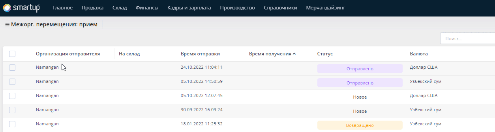

# Перемещение

## Внутреннее перемещение

### Что такое внутреннее перемещение маркированных товаров и для чего оно выполняется?

**Внутреннее перемещение** — это перемещение ТМЦ (материалы, товары, готовая продукция и т. д.) внутри организации для ее собственных нужд. И оно никак не связано с реализацией (передачей) активов сторонним субъектам хозяйствования и лицам.

### Процесс внутреннего перемещения маркированных товаров

* Перейдите в меню **Склад - Внутренние перемещения** и нажмите кнопку **Создать**.

* **В открывшемся форме вам нужно заполнить следующие блоки:**

**Основная информация**:

* номер перемещения - укажите номер текущего запроса (опционально)
* дата отправки - укажите дату отправки товара с одного склада в другой
* дата принятия - укажите дату принятия товара, поступившего с другого склада
* рабочая зона отправителя - здесь, указываете рабочую зону, с которой был отправлен товар
* запрос на внутреннее перемещение - если был оставлен запрос на перемещение, вы можете указать его.


Все поля, которые были затронуты в запросе на перемещение, будут автоматически заполнены в текущем документе.


* причина перемещения - укажите причину перемещения
* штат отправителя - укажите лицо, которое будет ответственным за текущее перемещение
* со склада - укажите склад, с которого будут отправлены товары
* на склад - укажите склад, в который будут приняты товары
* рабочая зона получателя - здесь, указываете рабочую зону, в которую будут приняты товары

<figure><figcaption></figcaption></figure>

После сохранения данных документ отобразится в списке документов внутреннего перемещения.


&#x20;На этом этапе документ внутреннего перемещения обязательно нужно сохранять в статусе **Забронировано** или "Черновик". При сохранении документа в других статусах будет возникать ошибка.


* Переходим в мобильную версию Smartup X, в раздел **"Внутреннее перемещение. Отправка"** и выбираем документ.

* Здесь нам необходимо отсканировать все коды маркировки, а затем (_если нет ошибок_) нажать на кнопку **Завершить**


При нажатии на кнопку **Завершить**, статус документа автоматически поменяется на **"В пути"**.


* Для завершения внутреннего перемещения необходимо, чтобы кладовщик на втором складе **оформил прием ТМЦ** через мобильное приложение.

* При приеме кладовщику также необходимо отсканировать коды маркировки и нажать кнопку **Завершить**.


В этом случае статус документа в веб-версии изменится на **«Завершено»**. В документе вы сможете просмотреть коды маркировки, прикрепленные к нему.


&#x20;У вас есть возможность изменить статус документа внутреннего перемещения, даже если он завершен: можно изменить статус с **"Завершено"** на **"В пути"**.

В списке документов внутреннего перемещения вам доступна **функция просмотра документа** (нужно нажать на кнопку "Просмотреть" под наименованием документа в списке). По этой кнопке вам откроется форма, где вы сможете просмотреть всю информацию по документу.


&#x20;Важный момент: Вы можете сформировать список документов таким образом, чтобы видеть, в каких документах присутствует маркировка, а в каких — не присутствует, а также просматривать коды маркировки перемещаемых товаров. Чтобы видеть эти данные, достаточно в настройках таблицы добавить столбец "Имеется маркировка".


#### Какие ошибки могут возникать при работе с маркированными товарами во внутреннем перемещении?

Про ошибку с неверно сохраненным статусом мы уже сказали выше.

**В каких еще случаях могут возникать ошибки?**

1. Если неверно выбран склад, то есть мы сканируем маркировку, которая относится к другому складу. В этом случае у нас не получится завершить документ.
2. Если отсканирована маркировка не всех товаров, которые указаны в документе внутреннего перемещения.
3. Если кладовщик сканирует маркировку, которая не занесена в систему.

## Меж-организационное перемещение

### Как происходит перемещение маркированных товаров из одной организации в другую?

* Оператор организации отправителя товаров, в веб версии системы **Smartup X** указывает нужное кол-во маркированных товаров для перемещения. После чего, кладовщик **организации отправителя**, используя мобильную версию приложения **Smartup X,** сканирует маркированные товары и передает товары экспедитору. **Экспедитор**, в свою очередь, доставляет товар до **организации получателя**. Далее, при выгрузке товаров, кладовщик организации получателя сканирует коды маркировок поставленных товаров и завершает прием. В итоге, оператор организации получателя видит, что товары были доставлены в их организацию.

#### **Процесс межорг. перемещения**

Процесс межорг. перемещения состоит из нескольких шагов:

* Оформление документа отправки товаров с организации отправителя
* Погрузка товаров на складе организации отправителя
* Прием товаров на складе организации получателя

### Оформление документа отправки товаров из организации отправителя

* Оператор организации получателя должен перейти в меню **Склад - Межорг. перемещения: отправка**, и в открывшейся форме нажать на кнопку **Создать**

* Далее, заполнить блоки:

1. **Основная информация**
2. **ТМЦ**
3. **Завершение**

#### Основная информация

В текущем блоке нужно указать:

* **Дату отправки** товаров с текущей организации
* **Номер накладной,** указывается опционально
* **Запрос на перемещение**, при условии если вы оставляли запрос на перемещение товаров с одной организации в другую
* **Причину перемещения**, указывается опционально
* **Рабочую зону отправителя**, здесь указываете одну из рабочих территорий текущей организации, за которой закреплены такие сущности как: _штат, склад..._
* **Штат**, лицо ответственное за отправку товаров

а также,

* **Организацию получателя**, здесь вам нужно будет указать организацию, куда будут отправлены товары с текущей организации


В поле  _**Общий остаток**_  вам будет доступна информация о доступном балансе (_денег_) организации получателя.


* **Со склада**, то есть склад текущей организации, с остатков которой, будут списываться товары
* **Тип цены**, указывается цена отравляемых товаров в организацию получателя
* **Тип оплаты**, из списка (_Наличные, перечисление или терминал_), выберите один из типов, по которому будут проданы товары другой организации
* поля **Договор** и **Проект**, указываете опционально, если таковы имеются

#### ТМЦ

В текущем блоке, укажите необходимые ТМЦ для перемещения. Выбрать ТМЦ можно либо:

* В поле **Название**, из списка доступных ТМЦ, кликните на нужные

* Нажимая на кнопку **Подбор**, из списка **Доступных**, выберите нужные товары

* Нажимая на кнопку **Импорт**, импортировать список нужных маркированных товаров. Для удобства, в форме импорта, вы можете загрузить шаблон заполнения ТМЦ и сделать перемещение товаров. В пункте **Настройка**, можете настроить очередность полей, а также первую и последнюю строку отображения полей в файле (шаблон) импорта

#### Завершение

В текущем блоке, сверьте все данные и переведите статус в **В ожидании**, для того чтобы данные документ о перемещении был виден кладовщику для погрузки товаров в машину

### Погрузка товаров на складе организации отправителя

* Как только оператор сохранил документ перемещения в веб-версии системы **Smartup X**, **кладовщик**, используя мобильное приложение Smartup X (в мобильном телефоне либо в ТСД) должен отсканировать нужные коды маркировок товаров и погрузить их в автолавку для экспедитора. Для этого, кладовщику нужно войти в мобильную версию приложения Smartup X и проделать нижеуказанные шаги, изображенные на скриншотах:


**План и Факт** кодов маркировок должен быть равным, иначе кладовщик не сможет завершить отправку маркированных товаров!


* На этом погрузка товаров со склада организации отправителя завершается. Далее, кладовщик организации получателя, должен будет принять товар.

### Прием товаров на складе организации получателя

* Как только товар пришел с организации получателя, оператор организации получателя должен подтвердить получение, для этого оператору, в форме **Межорг. перемещение Прием**, нужно перевести статус документа в **Принято**. Проделайте действия, показанные в гиф анимации снизу:

<figure><figcaption></figcaption></figure>

* Кладовщик организации получателя должен оприходовать поступивший товар, для этого, кладовщику необходимо проделать нижеуказанные шаги, изображенные на скриншотах:

<figure><figcaption></figcaption></figure>


**План и Факт** кодов маркировок должен быть равным, иначе кладовщик не сможет завершить прием маркированных товаров!


* На этом процесс перемещения маркированных товаров из одной организации в другую завершается.


&#x20;При завершении документа меж-организационного перемещения маркированных товаров этот документ уже нельзя будет отменить.

